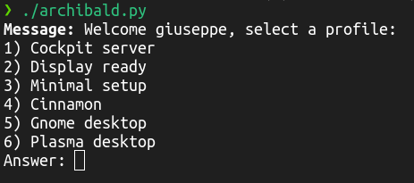

# Archibald ⚙️🐧

<div align="center">
  
</div>

Archibald is a small utility designed to help automate **post-install tasks** on a fresh system — such as installing a desktop environment, setting up your favourite packages, or dropping configuration files in the right place.

---

## Why not just use *archinstall*? 🤔

Archibald is for users who enjoy performing the **manual Arch Linux installation** by following the handbook, but don't want to manually reinstall and reconfigure their everyday tooling every single time.

Got a custom window manager setup? A fine-tuned list of packages? Archibald handles it: write your profile once, and you're done. 💨

---

## Requirements 📦

You only need:

* Python 3
* A user account with **sudo** privileges (*root* is actually **not supported**)
* `linux-headers` if you’re using **NVIDIA** hardware

---

## How to Use 🚀

Archibald can run either inside `arch-chroot` or on a fully booted system.
It’s intended to run as a **standalone script** — not a Python module (yet 😄).

Clone and run:

```bash
git clone https://github.com/.../archibald
cd archibald
chmod +x archibald.py
./archibald.py
```

Configuration profiles are stored under:

```
archibald/profiles/
```

More details below.

---

## Configuration Profiles 🧩

Profiles define exactly what Archibald should install or configure.
Place them inside `archibald/profiles/` following specific attributes that Archibald parses at runtime.
And yes... these are **actual python source code**.

Example profile:

```python
deps     = ["a_profile", "another"]              # Profile dependencies            | list, optional

name     = "Example"                             # Profile name                    | str, MANDATORY
        
drivers  = {                                     # Graphics drivers                | dict, optional
    "A Gpu Manifacturer": ["driverpackage1", "mesasomething"]
}
    
pkgs     = packages.ex + packages.ex2            # OR: pkgs = ["pkg1", "pkg2"]     | list, optional
    
units    = ["test", "example"]                   # Systemd services to enable      | list, optional
    
groups   = ["wheel", "example"]                  # User groups                     | list, optional
    
shell    = "/bin/somecustomshell"                # Custom shell (via chsh)         | str, optional

aur      = ["aurpkg", "another"]                 # AUR packages (paru auto-install)| list, optional

flatpaks = ["org.some.flatpak", "another"]       # Flatpak packages                | list, optional

bash     = ["a command", "another command"]      # Arbitrary bash commands         | list, optional

files    = {                                     # Custom configuration files      | dict, optional
    "filename": [
        "some/system/path/like/{home}",
        "somerandomtexttoputinyourfile"
    ]
}
```
